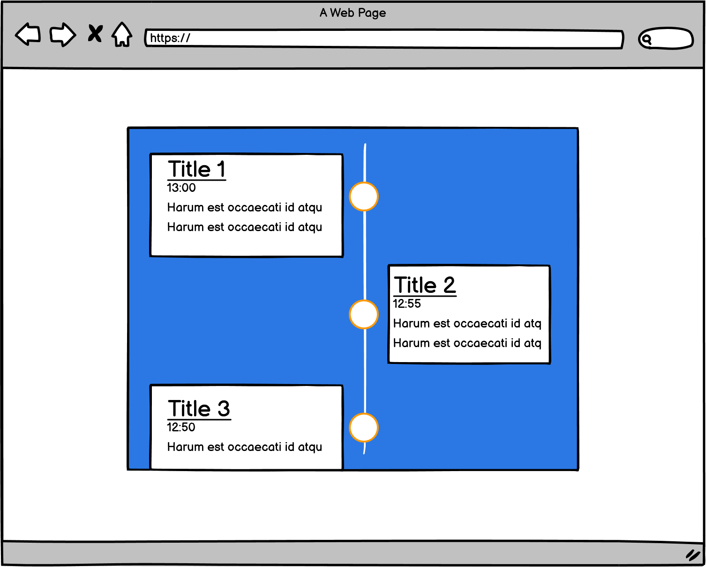

# Simple Event Viewer

This event viewer is used to illustrate an interesting way of delivering incremental event level data that is responsive across different view-ports.

You may find a live version of the built code [here](https://marcel-dev-acc.github.io/deployed-event-viewer/).

## Table of Contents

1. [User Experience (UX)](#1.-user-experience-UX)
    1. [Project Goals](#project-goals)
    2. [User Stories](#user-stories)
    3. [Color Scheme](#color-scheme)
    4. [Typography](#typography)
    5. [Wireframes](#wireframes)
2. [Features](#2.-features)
    1. [General](#general)
    2. [Desktop view](#desktop-view)
    3. [Mobile view](#mobile-view)
3. [Technologies Used](#3.-technologies-used)
    1. [Languages Used](#languages-used)
    2. [Frameworks, Libraries and Programs Used](#frameworks-libraries-and-programs-used)
4. [Testing](#4.-testing)
    1. [Testing User Stories](#testing-user-stories)
    2. [Code Validation](#code-validation)
    3. [Tools Testing](#tools-testing)
    4. [Manual Testing](#manual-testing)
5. [Finished Product](#5.-finished-product)
6. [Deployment](#6.-deployment)
    1. [GitHub Pages](#github-pages)

***

## 1. User Experience (UX)

### Project Goals

* The website provides a structured, easy to understand layout.

* Contains fun colours that provide more aesthetics compared to a black and white site.

* Responsive design to make the application accessible on different devices.

* Adhere to the given wireframe suggestions.

### User Stories

* As a user, I want the application to be simple.

* As a user, I want the documentation to be clear on what features are available.

* As a user, I want to see new events every five minutes.

* As a user, I want to have an application that functions across device sizes.

### Color Scheme

The colours used in the site are white (#fff) for the general background, timeline and timeline containers. A tone of grey-blue (#34495e) is used for the timeline background. The colour red-orange (#e74c3c) is used for the border of the points in the timeline.

The colors scheme is used to break the basic black and white layout and give some form of depth to the project. The colours are also meant to serve as a deviation from the general Bootstrap feel of sites these days.

### Typography

The font used in this project is Arial, a sans-serif font. Arial is commonly used in writing documents and makes sites feel more familiar to general users. Studies also suggest that the sans-serif font family is the most appealing to users.

### Wireframes

[Balsamiq](https://balsamiq.com/) has been used to showcase the appearance of the site and display the placement of the different elements in the pages.

Viewport size | Wireframe
--- | ---
">800px" | 
"<800px" | 

[Back to top ⇧](#simpl-event-viewer)

***

## 2. Features

### General

* The website has been designed from a mobile first perspective.

* The website is responsive across all device sizes.

* The website has a general limit of 1096px in size so as to not distort the content on larger monitors such as 4K monitors.

* __Desktop View__

    - The desktop view is meant to cater for users who will be keeping this event view open on a larger display.

* __Small Tablet View / Mobile View__

    - The mobile view is meant to cater for users who want to look at event timeline on the go.

### Future

* In the future it would be great to have the state interact with local storage so frequent users can load up a constant 5 events.

* In the future, and following on from the above, it would be great to have a refresh button. To clear the event view.

* In the future it would be good to have an event viewing date-time selector so that the user could go back in the past and view historical events.

[Back to top ⇧](#simpl-event-viewer)

***

## 3. Technologies Used

### Languages Used
* [HTML5](https://en.wikipedia.org/wiki/HTML5)
* [CSS3](https://en.wikipedia.org/wiki/CSS)
* [Javascript](https://en.wikipedia.org/wiki/JavaScript)

### Frameworks, Libraries and Programs Used

* [VS Code](https://code.visualstudio.com/)
     - GitPod was used for writing code, committing, and then pushing to GitHub.

* [GitHub](https://github.com/)
     - GitHub was used to store the project after pushing.

* [Balsamiq](https://balsamiq.com/)
     - Balsamiq was used to create the wireframes during the design phase of the project.

* [Am I Responsive?](http://ami.responsivedesign.is/#)
    - Am I Responsive was used in order to see responsive design throughout the process and to generate mockup imagery to be used.

* [Responsive Design Checker](https://www.responsivedesignchecker.com/)
    - Responsive Design Checker was used in the testing process to check responsiveness on various devices.

* [Chrome DevTools](https://developer.chrome.com/docs/devtools/)
    - Chrome DevTools was used during the development process for code review and to test responsiveness.

* [W3C Markup Validator](https://validator.w3.org/)
    - W3C Markup Validator was used to validate the HTML code.

* [W3C CSS Validator](https://jigsaw.w3.org/css-validator/)
    - W3C CSS Validator was used to validate the CSS code.

* [JSHint](https://jshint.com/) 
    - The JSHints JavaScript Code Quality Tool was used to validate the site's JavaScript code.

[Back to top ⇧](#simpl-event-viewer)

***

## 4. Testing

All testing can be found in the [TESTING.md](TESTING.md) file.

***

## 5. Finished Product

Page / Section | Image
--- | ---
Desktop Version | 
Mobile Version | 

[Back to top ⇧](#simpl-event-viewer)

## 6. Deployment

* This website was developed using VS Code, which was then committed and pushed to GitHub.

### GitHub Pages

* Here are the steps to deploy this website to GitHub Pages from the built files in this project:

    1. Copy this project locally using git functionality, such as `git clone`.

    2. Navigate into the root of the project and run `npm run build` as suggested in the __REACTJS.md__ file.

    3. Copy the contents of the build folder into a new repository and `push` the changes to the main branch in the [GitHub Repository](https://github.com/).

    4. At the top of the repository, locate the "Settings" button on the menu.

    5. Scroll down the Settings page until you locate the Pages section in the left-hand ribbon.

    6. Under Source, click the dropdown called None and select Master / Main branch.

    7. Click on save in order to deploy the site to GitHub Pages.

    8. The page will refresh automatically and generate a link to your website.

### React JS

More information relating to React specific commands can be found in the boilerplate instructable that comes with the project [REACTJS.md](REACTJS.md)

[Back to top ⇧](#simpl-event-viewer)

## Credits

### Content

* The content is pulled from the [JSONPlaceholder API](https://jsonplaceholder.typicode.com/) which provides a free API for fetching different types of data for testing / mock-up purposes.

* Much of html and css code had already been written for a previous project I had helped one of my mentees with.

* The README file template has been developed over about 5 iterations and is one I use with many of my students, I therefore thank them for the skeleton that has been used in this project.