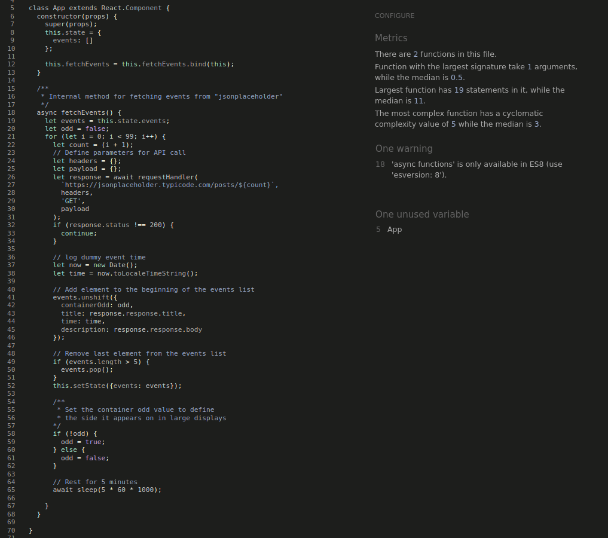
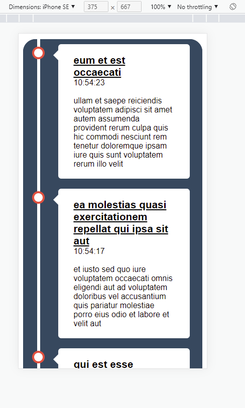

# Simple Event Viewer Testing

The general approach taken to development involved blocks of code being created and then being manually tested before proceeding. Demonstration of this can be seen in the historical commits of the project. Below you will find more robust testing methodologies applied to the project to make sure that the end user is receiving a great product.

## Testing User Stories

* As a user, I want the application to be simple.

    - The application has no distracting features on the page currently and so the focus is purely on wait for events to populate.

* As a user, I want the documentation to be clear on what features are available.

    - All features can be found in the [README](README.md) file in this repository.

* As a user, I want to see new events every five minutes.

    - New events will be requested approximately every 5 minutes from the JSONPlaceholder API, with about a 3 to 5 second drift for code execution.
    - The events are presented to the user in descending chronological order so that the only reason to scroll down is to see historical events in the last 25 minutes (5 events displayed in 5 minute increments) when the device size doesn't have enough vertical space to display all events.

* As a user, I want to have an application that functions across device sizes.

    - Manual tests below will demonstrate that this user story has been catered for.

## Code Validation

* The [W3C Markup Validator](https://validator.w3.org/) and [W3C CSS Validator](https://jigsaw.w3.org/css-validator/) services were used to validate all items of the project in order to ensure there were no syntax errors.

    - W3C Markup Validator returned 3 errors which were consequently fixed. They related to blank __href__ attributes, these fixes can be seen the final commit.

    

    - W3C CSS Validator found no errors, there are warnings in the CSS (illustration below) which have been ignored for the purposes of this project.

    

    

* The [JSHints JavaScript Code Quality Tool](https://jshint.com/) was used validate the site's JavaScript code.

    - __sleep.js validation__

        - No errors

    - __requestHandler.js__

        - Two warnings were suggested - these can be ignored

    

    - __fetchEvents() method in App.jsx__

        - For the sake of validation the entire jsx file contents was copied into the JSHint validator and the render method and other non-relevant methods stripped out  - warnings can be ignored

    

### Accessibility

* TBD: I used Lighthouse in Chrome DevTools to confirm that the colors and fonts being used in throughout the website are easy to read and accessible.

* Lighthouse reports

### Tools Testing

* [Chrome DevTools](https://developer.chrome.com/docs/devtools/)

    - The Chrome DevTools was used during the development process to test, explore and modify HTML elements and CSS styles used in the project.

* Responsiveness

    - [Am I Responsive?](http://ami.responsivedesign.is/#) was used to check responsiveness of the site pages across different devices.

    - [Responsive Design Checker](https://www.responsivedesignchecker.com/) was used to check responsiveness of the site pages on different screen sizes.

    - Chrome DevTools was used to test responsiveness in different screen sizes during the development process.

### Manual Testing

* Browser Compatibility

Browser | Outcome | Pass/Fail  
--- | --- | ---
Google Chrome | No appearance, responsiveness nor functionality issues.| Pass
Mozilla Firefox | No appearance, responsiveness nor functionality issues.| Pass
Microsoft Edge | No appearance, responsiveness nor functionality issues. | Pass

**Comments:** On Firefox the time taken for the event to appear seemed extremely lagged. The assumption is that the machine used to test this was not as robust as the one used for Chrome or Edge.

* Device compatibility

Device | Outcome | Illustration | Pass/Fail
--- | --- | --- | ---
Desktop | No appearance, responsiveness nor functionality issues. |  | Pass
iPad Air | No appearance, responsiveness nor functionality issues. |  | Pass
aPad Mini | No appearance, responsiveness nor functionality issues. |  | Pass
iPhone SE | No appearance, responsiveness nor functionality issues. |  | Pass

**Comments:** On a rotated iPhone SE the device size remains under the 800px media query, however for iPhone XR the rotated device size changes to 896px, this was found to work as expected, i.e. change to a "desktop view".

* Common Elements Testing

    - First event appearing

    

    - Further events appearing in a descending chronological order

    

* JEST testing

Due to current time constraints only trivial unit test has been implemented for the following:

    - <App />
    - <LeftContainer />
    - <RightContainer />

Reason: The code is fairly trivial, the project is tiny and the manual tests robustly cover the desired functionality.
